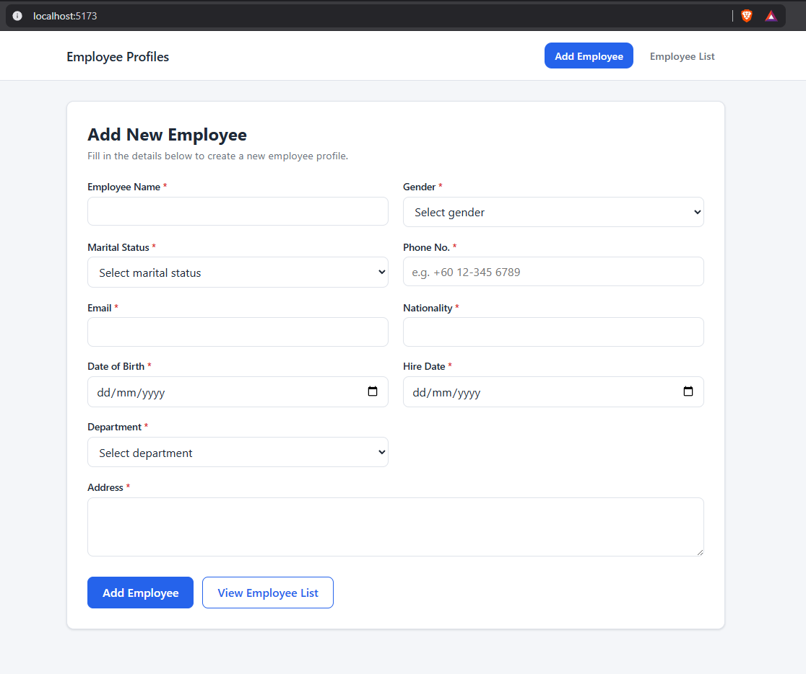
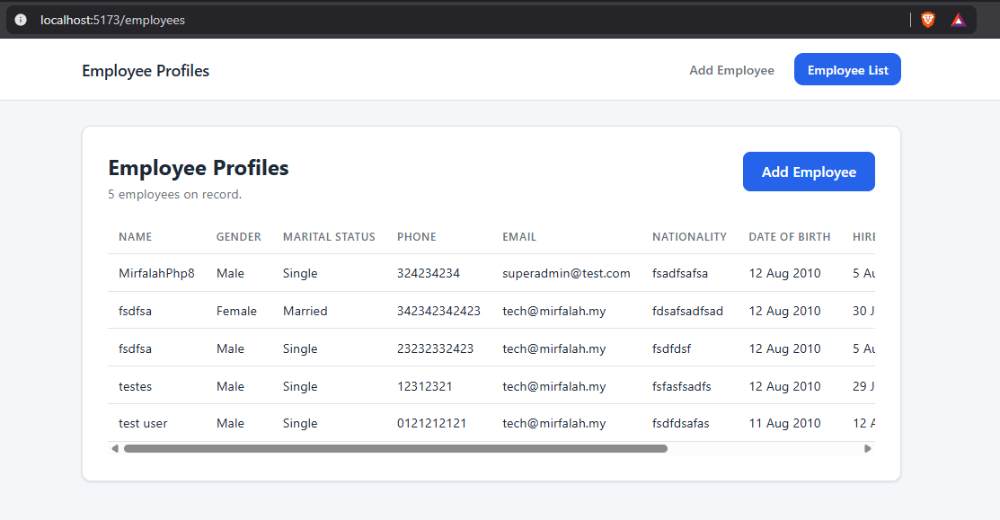

# Employee Profile App

A small full-stack app to add and list employee profiles.

- **Backend**: Laravel (PHP), REST API, employees persisted to a JSON file (`backend/storage/app/private/employees.json`)
- **Frontend**: React (Vite), employee form + employee list, client + server-side validation

## Screenshots

**Add Employee**



**Employee List**



## Running with Docker (recommended)

This is the easiest way to run the project — you only need [Docker Desktop](https://www.docker.com/products/docker-desktop/) installed, no PHP/Composer/Node required on your machine.

```bash
docker compose up -d --build
```

- Frontend: http://localhost:5173
- Backend API: http://localhost:8000/api

First start takes a little longer since Composer/npm dependencies install inside the containers. Watch progress with:

```bash
docker compose logs -f
```

Stop everything with:

```bash
docker compose down
```

## Running without Docker

If you'd rather run things natively, you'll need PHP 8.2+, Composer, and Node 20+.

**Backend**

```bash
cd backend
composer install
cp .env.example .env   # if .env doesn't already exist
php artisan key:generate
php artisan serve
```

**Frontend**

```bash
cd frontend
npm install
npm run dev
```

By default the frontend calls `http://localhost:8000/api`. Override this by setting `VITE_API_URL` (e.g. in `frontend/.env`).

## Project structure

```
backend/    Laravel API (routes/api.php, app/Http/Controllers/Api, app/Repositories)
frontend/   React app (src/pages, src/api, src/validation)
docker-compose.yml
```

## API

| Method | Endpoint              | Description                                   |
| ------ | ---------------------- | ---------------------------------------------- |
| GET    | `/api/employees`       | List all employees                             |
| POST   | `/api/employees`       | Create an employee (validated, saved to JSON)  |
| GET    | `/api/employee-options`| Dropdown option lists (gender, marital status, department) |

## Task

1. Create a form to add new employee

    ```
    Employee Name
    Gender
    Martial Status
    Phone No.
    Email
    Address
    Date of birth
    Nationality
    Hire Date
    Department
    ```
    - You can add any other field that is relevant.
    - Add validation to the input for both frontend and backend
    - Implement REST API to pass data
    - After validation, if form is valid, save into json or csv

2. Show all employee profile pulled from json or csv in a new screen

## Language
- Frontend
    - Normal HTML5 and css or REACT

- Backend
    - Normal PHP or LARAVEL

## BONUS POINT

- Clean code and good practise
- Good UI UX
